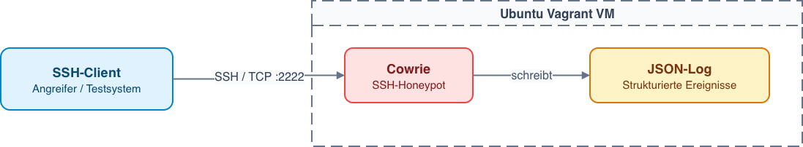
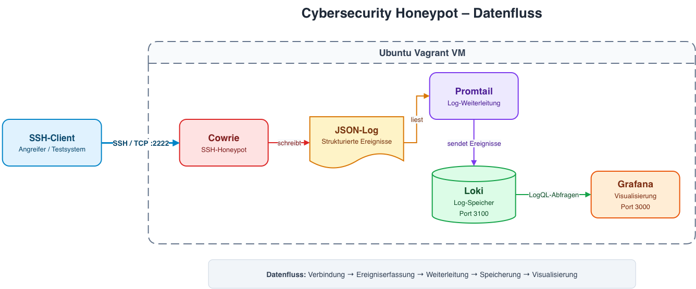

# Cybersecurity-Honeypot-Plattform

## Projektübersicht

Dieses Projekt stellt eine automatisierte Laborumgebung bereit, in der SSH-Angriffe erfasst und ausgewertet werden können. Cowrie simuliert einen SSH-Server und protokolliert Verbindungen, Anmeldeversuche und eingegebene Befehle. In der erweiterten Ausbaustufe werden diese Ereignisse mit Promtail an Loki übertragen und in Grafana visualisiert.

Die Dokumentation trennt die Arbeit in zwei aufeinander aufbauende Phasen:

- **Phase 1 – Modularbeit:** Aufbau und Test eines funktionsfähigen Cowrie-Honeypots.
- **Phase 2 – Projektarbeit/Erweiterung:** Ergänzung einer zentralen Log-Pipeline und grafischen Auswertung mit Promtail, Loki und Grafana.

Die heute vorhandene Installation enthält bereits beide Phasen. Vagrant erstellt dafür eine Ubuntu-VM; Docker Compose startet und verwaltet alle Dienste.

> Die Umgebung ist ausschliesslich für Schulungs- und Testzwecke bestimmt. Angriffsversuche dürfen nur gegen dieses eigene Labor oder gegen ausdrücklich freigegebene Systeme durchgeführt werden.

## Abgrenzung der beiden Phasen

### Phase 1 – Modularbeit: Cowrie-Honeypot

Ziel der Modularbeit ist ein isolierter und reproduzierbarer SSH-Honeypot. Cowrie nimmt Verbindungen auf Port `2222` entgegen, simuliert eine Linux-Shell und schreibt die Aktivitäten als JSON-Ereignisse in eine Protokolldatei. Die Funktion wird mit einem Portscan, Anmeldeversuchen und einer interaktiven SSH-Sitzung geprüft. Die Ereignisse können direkt in den Cowrie-Protokollen kontrolliert werden.

Vagrant und Docker Compose gehören zur technischen Betriebsbasis: Vagrant stellt die virtuelle Maschine bereit, Docker Compose startet Cowrie als Container.

### Phase 2 – Projektarbeit: Monitoring und Visualisierung

Die Projektarbeit erweitert den Honeypot, ohne seine Grundfunktion zu verändern. Promtail liest die JSON-Protokolle von Cowrie fortlaufend ein und sendet sie an Loki. Loki speichert die Ereignisse zentral und stellt sie für LogQL-Abfragen bereit. Grafana verwendet Loki als Datenquelle und zeigt Verbindungen, fehlgeschlagene Anmeldungen sowie eingegebene und verdächtige Befehle in einem vorbereiteten Dashboard an.

Damit wird aus dem einzelnen Honeypot eine kleine Monitoring- und Analyseplattform.

## Architektur

### Architektur Phase 1



**Datenfluss:** Verbindung → Ereigniserfassung → lokale Protokollierung

Der Schwerpunkt liegt auf dem Honeypot selbst: Dienst bereitstellen, Testangriffe annehmen und Ereignisse nachvollziehbar protokollieren. Vagrant und Docker Compose bilden die gemeinsame Betriebsbasis.

### Architektur Phase 2



Alle Komponenten laufen als Docker-Container innerhalb derselben von Vagrant verwalteten Ubuntu-VM. Docker-Volumes speichern Cowrie-, Loki-, Promtail- und Grafana-Daten dauerhaft innerhalb der VM.

## Funktionsumfang

| Funktion | Phase 1: Modularbeit | Phase 2: Projektarbeit |
| --- | :---: | :---: |
| Reproduzierbare Ubuntu-VM mit Vagrant | ✓ | ✓ |
| Containerbetrieb mit Docker Compose | ✓ | ✓ |
| Simulierter SSH-Dienst mit Cowrie | ✓ | ✓ |
| Aufzeichnung von Verbindungen und Anmeldungen | ✓ | ✓ |
| Aufzeichnung eingegebener Befehle | ✓ | ✓ |
| Direkte Kontrolle der Cowrie-JSON-Protokolle | ✓ | ✓ |
| Automatische Log-Weiterleitung mit Promtail | – | ✓ |
| Zentrale Log-Speicherung in Loki | – | ✓ |
| Suche und Auswertung mit LogQL | – | ✓ |
| Vorbereitetes Grafana-Dashboard | – | ✓ |

## Komponenten

| Komponente | Aufgabe |
| --- | --- |
| **Cowrie** | Simuliert einen SSH-Server und zeichnet Verbindungen, Login-Versuche und Befehle als JSON-Ereignisse auf. |
| **Promtail** | Liest neue Cowrie-Ereignisse aus den JSON-Protokollen und übermittelt sie an Loki. |
| **Loki** | Speichert die Protokolle zentral und ermöglicht deren Abfrage mit LogQL. |
| **Grafana** | Fragt Loki ab und visualisiert die Ereignisse in einem Dashboard. |
| **Vagrant** | Erstellt und provisioniert die Ubuntu-VM, inklusive Portweiterleitungen zum Hostsystem. |
| **Docker Compose** | Erstellt, startet und verwaltet die Container der Plattform. |

## Begründung der Technologieauswahl

Die Technologien wurden so gewählt, dass sich die Laborumgebung reproduzierbar aufbauen und später schrittweise erweitern lässt. Die folgende Tabelle stellt jeder eingesetzten Technologie eine mögliche Alternative gegenüber:

| Verwendete Technologie | Mögliche Alternative | Begründung der Auswahl |
| --- | --- | --- |
| **Cowrie** | OpenCanary | Cowrie ist speziell für interaktive SSH-Sitzungen geeignet und protokolliert Login-Versuche sowie eingegebene Befehle strukturiert als JSON. |
| **Promtail** | Grafana Alloy | Promtail liess sich für die vorliegende Projektversion einfach konfigurieren, liest die Cowrie-JSON-Protokolle direkt ein und übermittelt sie an Loki. |
| **Loki** | Elasticsearch | Loki ist auf die Speicherung von Protokollen ausgerichtet, lässt sich direkt mit Grafana verbinden und benötigt für dieses kleine Labor weniger komplexe Infrastruktur. |
| **Grafana** | Kibana | Grafana unterstützt Loki direkt und ermöglicht die benötigten Dashboards sowie LogQL-Auswertungen. |
| **Vagrant** | VirtualBox ohne Vagrant | Vagrant automatisiert Aufbau, Konfiguration und Provisionierung der VM. Dadurch lässt sich die Umgebung reproduzierbar mit `vagrant up` starten. |
| **Docker Compose** | Kubernetes | Docker Compose ist für vier Container auf einer einzelnen Labor-VM einfacher zu konfigurieren und zu betreiben. Kubernetes wäre für diesen Projektumfang unnötig komplex. |

Die Kombination unterstützt damit sowohl die einfache Grundversion der Modularbeit als auch die spätere Erweiterung zur zentralen Monitoring-Plattform.

## Voraussetzungen

Für den empfohlenen Betrieb mit VirtualBox werden benötigt:

- Git
- Vagrant 2.4 oder neuer
- VirtualBox 7.x
- aktivierte Hardware-Virtualisierung
- mindestens 4 GB freier Arbeitsspeicher
- ungefähr 10 GB freier Speicherplatz
- Internetzugang beim ersten Start

Optional wird Parallels Desktop mit dem Plugin `vagrant-parallels` unterstützt.

## Setup und Start

Repository klonen und in das Projektverzeichnis wechseln:

```bash
git clone <repository-url>
cd cybersecurity-honeypot-platform
```

Die VM und die vollständige Plattform starten:

```bash
cd honeypot-vm && vagrant up
```

Vagrant verwendet standardmässig einen verfügbaren Provider. Um VirtualBox oder Parallels ausdrücklich auszuwählen:

```bash
vagrant up --provider=virtualbox
# oder
vagrant up --provider=parallels
```

Beim ersten Start werden die Ubuntu-Box, Docker und die Container-Images geladen. Dieser Vorgang kann mehrere Minuten dauern. Anschliessend startet Docker Compose automatisch die vier Dienste `cowrie`, `promtail`, `loki` und `grafana`.

Status der Container prüfen:

```bash
vagrant ssh -c "cd /project && docker compose ps"
```

Alle vier Dienste sollten den Status `Up` besitzen. Loki kann zusätzlich unter <http://localhost:3100/ready> geprüft werden; nach einer kurzen Startzeit erscheint dort `ready`.

## Zugriff auf Grafana und Cowrie

| Dienst | Adresse | Zugang |
| --- | --- | --- |
| Grafana | <http://localhost:3000> | `admin` / `admin` |
| Cowrie SSH | `localhost:2222` | `root` / `toor` |
| Loki-Status | <http://localhost:3100/ready> | kein Login |

Nach der Anmeldung in Grafana ist Loki bereits als Standard-Datenquelle eingerichtet. Das Dashboard **Cowrie Honeypot Overview** befindet sich im Ordner **Honeypot**.

Die Beispiel-Zugangsdaten von Cowrie und Grafana sind absichtlich einfach und nur für das isolierte Labor vorgesehen.

## Testanleitung für die Phasen

Die folgenden Schritte zeigen, wie die Ergebnisse beider Phasen überprüft werden können. Die vollständige Plattform bleibt dabei gestartet: Für Phase 1 wird nur die Grundfunktion von Cowrie geprüft, für Phase 2 zusätzlich die Weiterleitung und Visualisierung. Ein Umbau oder Abschalten einzelner Dienste ist nicht notwendig.

### Vorbereitung

Die Installation gemäss **Setup und Start** abschliessen und zwei Terminalfenster auf dem eigenen Computer, beispielsweise dem Mac, öffnen. Für die Pflichtprüfung werden nur SSH und für Phase 2 ein Browser benötigt; Nmap und Hydra sind optional.

**Terminal A – Verbindung zum Vagrant-Server herstellen:** Zuerst im lokalen Terminal in den Projektunterordner `honeypot-vm` wechseln. Falls man bereits dort ist, entfällt `cd honeypot-vm`. Vom Projektverzeichnis aus:

```bash
cd honeypot-vm
vagrant ssh
```

Ab jetzt ist **Terminal A auf dem Vagrant-Server (Ubuntu-VM)** angemeldet. Dort werden die Protokolle gelesen und die Docker-Dienste geprüft. `vagrant`-Befehle werden dagegen immer auf dem lokalen Computer ausgeführt, nicht innerhalb dieser Server-Shell.

**Terminal B – lokal bleiben:** Das zweite Terminal bleibt zunächst auf dem eigenen Computer. Von dort wird die SSH-Verbindung zu Cowrie auf Port `2222` gestartet. Vagrant leitet `127.0.0.1:2222` vom lokalen Computer an Cowrie in der VM weiter.

| Fenster / Umgebung | Verwendung |
| --- | --- |
| **Terminal A: Vagrant-Server** | Nach `vagrant ssh`: echte Ubuntu-Shell zum Lesen der JSON-Protokolle und Prüfen der Container. |
| **Terminal B: lokaler Computer** | SSH-Verbindung zu Cowrie starten; optionale Nmap- und Hydra-Tests ausführen. |
| **Terminal B: Cowrie-Shell** | Nach erfolgreicher SSH-Anmeldung auf Port `2222`: Testbefehle im simulierten System eingeben. Mit `exit` gelangt man zurück auf den lokalen Computer. |
| **Browser: lokaler Computer** | Loki-Status und Grafana über `localhost` öffnen. |

> Die Server-Shell in Terminal A und die simulierte Cowrie-Shell in Terminal B sind nicht dasselbe: Verwaltungsbefehle gehören auf den Vagrant-Server, simulierte Angreiferbefehle ausschliesslich in die Cowrie-Shell.

### Phase 1 testen – Cowrie und lokale Protokollierung

**1. Protokolle beobachten – Terminal A, auf dem Vagrant-Server:** Nach der Anmeldung mit `vagrant ssh` die laufende Log-Anzeige starten:

```bash
sudo tail -f /var/lib/docker/volumes/honeypot_cowrie-data/_data/log/cowrie/cowrie.json
```

Der Befehl liest das Docker-Volume direkt in der VM. Er benötigt kein `tail` innerhalb des Cowrie-Containers. Der Pfad gilt für den voreingestellten Compose-Projektnamen `honeypot`. Falls die Datei beim ersten Start noch fehlt, zuerst Schritt 2 ausführen und den Log-Befehl erneut starten.

**2. Fehlgeschlagene und erfolgreiche Anmeldung erzeugen – Terminal B, lokal auf dem eigenen Computer:** Die Verbindung zum Honeypot starten:

```bash
ssh -o PreferredAuthentications=password -o PubkeyAuthentication=no -p 2222 root@127.0.0.1
```

Beim ersten Verbindungsaufbau die Hostschlüssel-Abfrage für die eigene Laborumgebung mit `yes` bestätigen. Bei der Passwortabfrage zunächst absichtlich `falsch123` eingeben. Nach der Ablehnung bei der nächsten Passwortabfrage `toor` eingeben. Während der Passworteingabe werden keine Zeichen angezeigt.

**3. Befehle protokollieren – Terminal B, jetzt in der Cowrie-Shell:** Nach der erfolgreichen Anmeldung diese Befehle nur im simulierten Honeypot eingeben:

```bash
whoami
uname -a
echo TEKO-PHASE1-TEST
exit
```

Mit `exit` wird die Cowrie-Sitzung beendet. Terminal B ist danach wieder auf dem lokalen Computer.

**4. Ergebnis kontrollieren – Terminal A, auf dem Vagrant-Server:** In der laufenden Log-Anzeige sollten passende JSON-Ereignisse erscheinen:

| Testschritt | Erwartetes Ereignis / Prüfkriterium |
| --- | --- |
| SSH-Verbindung öffnen | `cowrie.session.connect` |
| Passwort `falsch123` verwenden | `cowrie.login.failed` |
| Passwort `toor` verwenden | `cowrie.login.success` |
| Befehle eingeben | `cowrie.command.input`; das Feld `input` enthält unter anderem `echo TEKO-PHASE1-TEST`. |
| Sitzung mit `exit` beenden | `cowrie.session.closed` |

**Phase 1 ist erfolgreich geprüft**, wenn der Login-Test und die eingegebenen Befehle in den JSON-Protokollen auf dem Vagrant-Server nachvollziehbar sind. Grafana ist für diesen Nachweis nicht erforderlich. Die Log-Anzeige kann für Phase 2 geöffnet bleiben; `Ctrl+C` beendet nur die Anzeige, nicht den Honeypot. Terminal A bleibt danach in der Ubuntu-Shell; erst `exit` führt zurück zum lokalen Computer.

### Phase 2 testen – Log-Pipeline und Grafana

**1. Dienste und Dashboard prüfen – Browser auf dem lokalen Computer:** Unter <http://localhost:3100/ready> muss nach der Startphase `ready` erscheinen. Anschliessend <http://localhost:3000> öffnen und mit `admin` / `admin` anmelden, sofern das Passwort nicht bereits geändert wurde. Im Ordner **Honeypot** das Dashboard **Cowrie Honeypot Overview** öffnen und den Zeitraum auf **Letzte 15 Minuten** setzen.

**2. Neue, eindeutig erkennbare Testdaten erzeugen – Terminal B:** Zunächst **lokal auf dem eigenen Computer** die SSH-Verbindung erneut starten:

```bash
ssh -o PreferredAuthentications=password -o PubkeyAuthentication=no -p 2222 root@127.0.0.1
```

Wieder zuerst `falsch123`, danach `toor` eingeben. Nach erfolgreicher Anmeldung **in der Cowrie-Shell** ausführen:

```bash
echo TEKO-PHASE2-TEST
echo TEKO-PHASE2-payload-TEST
exit
```

Nach `exit` ist Terminal B wieder lokal. Der zweite Befehl ist harmlos. Das Wort `payload` löst lediglich den vorhandenen Suchfilter für verdächtige Befehle aus; es wird nichts heruntergeladen oder installiert. Der Filter ist eine einfache Stichwortsuche und kein Beweis für einen tatsächlichen Angriff.

**3. Anzeige überprüfen – Grafana im lokalen Browser:** Einige Sekunden auf die Weiterleitung warten und das Dashboard aktualisieren. Die folgenden Panels sollten die neuen Ereignisse im ausgewählten Zeitraum berücksichtigen:

| Panel | Erwartetes Ergebnis |
| --- | --- |
| **SSH Sessions** | Die neue SSH-Verbindung wird mitgezählt. |
| **Failed Logins** / **Successful Logins** | Der fehlgeschlagene und der erfolgreiche Login werden mitgezählt. |
| **Attack Events Over Time** | Die neu erzeugten Cowrie-Ereignisse erscheinen in der Zeitreihe. |
| **Executed Commands** | Die beiden Befehle mit `TEKO-PHASE2` sind sichtbar. |
| **Suspicious Commands** | `echo TEKO-PHASE2-payload-TEST` erscheint wegen des Stichworts `payload`. |

Bereits vorhandene Tests können in die Zähler einfliessen. Deshalb sind die markierten Befehle der eindeutigere Nachweis als ein bestimmter Gesamtwert.

**4. Log-Pipeline gezielt nachweisen – Grafana im lokalen Browser:** Unter **Explore** die Datenquelle **Loki** und ebenfalls **Letzte 15 Minuten** auswählen. Diese LogQL-Abfrage in Grafana ausführen, nicht in einem Terminal:

```logql
{job="cowrie", eventid="cowrie.command.input"} |= "TEKO-PHASE2"
```

Die Einträge mit den beiden Testbefehlen müssen sowohl im JSON-Log auf dem Vagrant-Server (Terminal A) als auch in Grafana auffindbar sein. Wiederholte Tests können zusätzliche Treffer erzeugen; zur Zuordnung die Zeitstempel vergleichen.

**Phase 2 ist erfolgreich geprüft**, wenn dieselben neuen Ereignisse über die Kette Cowrie → JSON-Log → Promtail → Loki bis nach Grafana gelangen und dort abgefragt sowie im Dashboard angezeigt werden.

### Falls ein Test nicht funktioniert

Für die folgenden Server-Prüfbefehle in Terminal A zunächst die Log-Anzeige mit `Ctrl+C` beenden. Terminal A muss weiterhin auf dem Vagrant-Server angemeldet sein.

| Beobachtung | Nächster Prüfschritt |
| --- | --- |
| SSH-Verbindung zu Cowrie wird abgelehnt | In **Terminal A auf dem Server** `cd /project && docker compose ps` ausführen. Cowrie muss laufen; die Testverbindung aus **Terminal B lokal** muss Port `2222` verwenden. Falls bereits `vagrant ssh` nicht funktioniert, **lokal** im Ordner `honeypot-vm` mit `vagrant status` den VM-Status prüfen. |
| Keine neuen JSON-Ereignisse auf dem Server | In **Terminal A auf dem Server** die Log-Anzeige aus Schritt 1 erneut starten. In **Terminal B lokal** eine neue SSH-Verbindung zu Cowrie erzeugen. Prüfen, ob der Standard-Projektname `honeypot` verwendet wird. |
| Ereignisse auf dem Server vorhanden, aber keine Treffer in Grafana | Im **lokalen Browser** Zeitraum und Datenquelle kontrollieren, kurz warten und aktualisieren. Danach in **Terminal A auf dem Server** `cd /project && docker compose logs --tail=100 promtail loki` auf Weiterleitungsfehler prüfen. |
| Explore zeigt Treffer, aber ein Dashboard-Panel bleibt leer | Dashboard-Zeitraum prüfen und aktualisieren. Für **Suspicious Commands** muss der Testbefehl das Wort `payload` enthalten. |

Als Abgabenachweis eignen sich ein Ausschnitt der JSON-Log-Anzeige aus Terminal A für Phase 1 und ein Screenshot von Dashboard beziehungsweise Explore mit den markierten Testbefehlen für Phase 2.

## Optionale Angriffssimulationen

Die folgenden zusätzlichen Tests werden in **Terminal B lokal auf dem eigenen Computer** ausgeführt, nicht auf dem Vagrant-Server und nicht in der Cowrie-Shell. Falls noch eine Cowrie-Sitzung offen ist, zuerst mit `exit` zurückkehren. Die Tests richten sich ausschliesslich gegen die eigene Laborumgebung. Die Ergebnisse lassen sich in Terminal A in den JSON-Protokollen (Phase 1) und im lokalen Browser in Grafana (Phase 2) überprüfen.

### Portscan mit Nmap

```bash
nmap -sV -p 2222 127.0.0.1
```

Der Scan sollte einen SSH-Dienst erkennen. Typische Cowrie-Ereignisse sind `cowrie.session.connect`, `cowrie.client.version` und `cowrie.session.closed`.

### Login-Versuche mit Hydra

Eine kleine Testliste erstellen und gegen Cowrie verwenden:

```bash
printf "admin\npassword\n123456\ntoor\n" > passwords.txt
hydra -l root -P passwords.txt ssh://127.0.0.1:2222
```

Dabei entstehen unter anderem die Ereignisse `cowrie.login.failed` und `cowrie.login.success`. Nmap und Hydra sind optionale Testwerkzeuge und werden nicht für den Betrieb der Plattform benötigt.

## Wichtigste LogQL-Abfragen

Die Abfragen können in Grafana unter **Explore** mit der Datenquelle **Loki** ausgeführt werden.

Alle Cowrie-Ereignisse:

```logql
{job="cowrie"}
```

Neue SSH-Verbindungen:

```logql
{job="cowrie", eventid="cowrie.session.connect"}
```

Fehlgeschlagene Anmeldungen:

```logql
{job="cowrie", eventid="cowrie.login.failed"}
```

Erfolgreiche Anmeldungen:

```logql
{job="cowrie", eventid="cowrie.login.success"}
```

Eingegebene Befehle:

```logql
{job="cowrie", eventid="cowrie.command.input"}
```

Verdächtige Befehle mit `wget`, `curl`, `chmod` oder `payload`:

```logql
{job="cowrie", eventid="cowrie.command.input"} | json | input =~ "(?i).*(wget|curl|chmod|payload).*"
```

Anzahl fehlgeschlagener Anmeldungen im gewählten Grafana-Zeitraum:

```logql
sum(count_over_time({job="cowrie", eventid="cowrie.login.failed"}[$__range]))
```

## Bedienung und Fehlersuche

Die Befehle werden im Verzeichnis `honeypot-vm` ausgeführt:

```bash
# VM anhalten und erneut starten
vagrant halt
vagrant up

# Shell der VM öffnen
vagrant ssh

# Containerstatus und aktuelle Container-Protokolle anzeigen
vagrant ssh -c "cd /project && docker compose ps"
vagrant ssh -c "cd /project && docker compose logs --tail=100"

# Provisionierung erneut ausführen
vagrant provision
```

Bei Parallels wird das Projekt per RSync in die VM kopiert. Änderungen können wie folgt übertragen und angewendet werden:

```bash
vagrant rsync
vagrant ssh -c "cd /project && docker compose up -d --build"
```

VirtualBox verwendet dagegen einen direkt eingebundenen Projektordner.

Die VM kann bei Bedarf vollständig entfernt und mit `vagrant up` neu erstellt werden:

```bash
vagrant destroy -f
```

Dabei gehen die Docker-Volumes innerhalb der VM verloren. Manuell erstellte Grafana-Dashboards sollten vorher exportiert werden.

## Projektstruktur

```text
cybersecurity-honeypot-platform/
├── README.md
├── docker-compose.yml
├── cowrie/
├── grafana/
│   └── provisioning/
├── honeypot-vm/
│   ├── Vagrantfile
│   └── scripts/
├── loki/
└── promtail/
```

## Ausblick

Die bestehende Plattform kann später ergänzt werden, ohne die aktuelle Architektur grundsätzlich umzubauen:

- **Alerts:** Grafana kann bei auffälligen Login-Raten oder bestimmten Befehlen Benachrichtigungen auslösen.
- **GeoIP:** Quell-IP-Adressen können geografisch angereichert und als Herkunftsregionen dargestellt werden.
- **Wazuh:** Eine zusätzliche SIEM-/XDR-Lösung kann Ereignisse korrelieren, Regeln anwenden und die Analyse erweitern.

Diese Punkte sind bewusst als mögliche Weiterentwicklung abgegrenzt und nicht Bestandteil der beiden umgesetzten Phasen.

## Sicherheitshinweis

Der Honeypot verwendet absichtlich schwache Beispiel-Zugangsdaten und ist nicht als produktiv abgesichertes System konzipiert. Er darf nicht ohne zusätzliche Schutzmassnahmen direkt aus dem Internet erreichbar gemacht werden. Alle beschriebenen Scan- und Angriffstests sind nur in der eigenen Laborumgebung oder mit ausdrücklicher Genehmigung zulässig.
